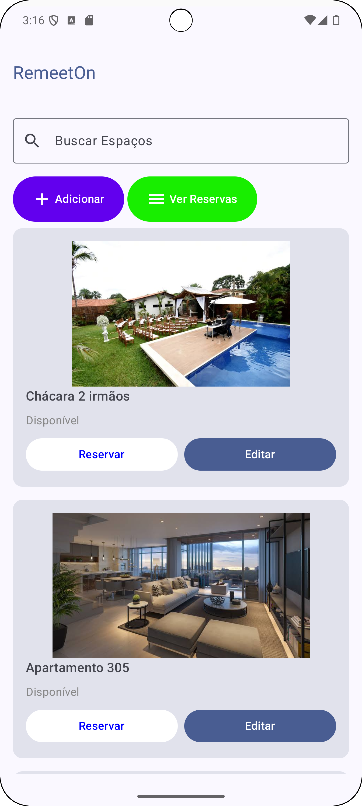

## RemeetOn - Sua plataforma de reservas de espaços

RemeetOn é um aplicativo Android desenvolvido em Kotlin que permite aos usuários encontrar e reservar espaços para diversos fins. O aplicativo se conecta ao Firebase para autenticação de usuários, armazenamento de dados e gerenciamento de reservas.



### Funcionalidades Principais

* **Autenticação de Usuário:** os usuários podem se cadastrar e fazer login no aplicativo usando suas credenciais de e-mail e senha.
* **Cadastro de Espaços:** usuários autenticados podem cadastrar novos espaços, fornecendo informações como nome, descrição, endereço, capacidade, horários de funcionamento e fotos.
* **Busca e Filtro de Espaços:**  encontre facilmente o espaço ideal utilizando a barra de pesquisa para filtrar por nome.
* **Reserva de Espaços:** visualize a disponibilidade dos espaços e faça reservas para o dia e horário desejados.
* **Gerenciamento de Reservas:** acompanhe suas reservas e cancele-as, se necessário.
* **Edição de Perfil de Usuário:** os usuários podem atualizar seus perfis.
* **Exclusão de Usuário:** os usuários podem excluir suas contas.

### Tecnologia Utilizada

* **Linguagem de Programação:** Kotlin
* **Framework de Interface do Usuário:** Jetpack Compose
* **Banco de Dados:** Firebase Firestore
* **Armazenamento de Imagens:** URLs de imagens armazenadas externamente (sugestão: Firebase Storage)

### Telas Principais

* **Tela de Login:** permite que usuários existentes façam login com suas credenciais ou se direcionem para a tela de cadastro.
* **Tela de Cadastro de Usuário:** coleta nome, e-mail e senha para criar uma nova conta de usuário.
* **Tela Inicial:** exibe os espaços disponíveis, permitindo busca, visualização de detalhes e reserva.
* **Tela de Cadastro de Espaço:** coleta informações detalhadas sobre o espaço, incluindo nome, descrição, localização, capacidade, fotos e horários de funcionamento.
* **Tela de Edição de Espaço:** permite editar as informações de um espaço previamente cadastrado.
* **Tela de Reservas:** exibe as reservas do usuário, permitindo o cancelamento, se necessário.
* **Tela de Edição de Usuário:** permite que os usuários atualizem seus perfis, incluindo nome e e-mail.

### Próximos Passos

* Implementar o upload de imagens para o Firebase Storage.
* Adicionar um sistema de pagamento para processar as reservas.
* Implementar um sistema de notificações para lembrar os usuários sobre as próximas reservas.
* Permitir que os usuários avaliem os espaços que reservaram.
* Implementar um mapa para exibir a localização dos espaços.

### Como Executar o Projeto

1. Clone este repositório para sua máquina local.
```
git clone https://github.com/seu-usuario/remeeton.git
```
2. Abra o projeto no Android Studio.
3. Crie um novo projeto no Firebase e adicione o arquivo `google-services.json` ao seu projeto.
4. Configure as dependências do Firebase no seu projeto.
5. Execute o aplicativo em um emulador ou dispositivo Android.

### Contribuindo

Contribuições são bem-vindas! Sinta-se à vontade para abrir um problema ou enviar um pull request.

### Autores

- [Allan Amâncio](https://github.com/AllanSmithll)
- [Márcio José](https://github.com/ImMarcio)
